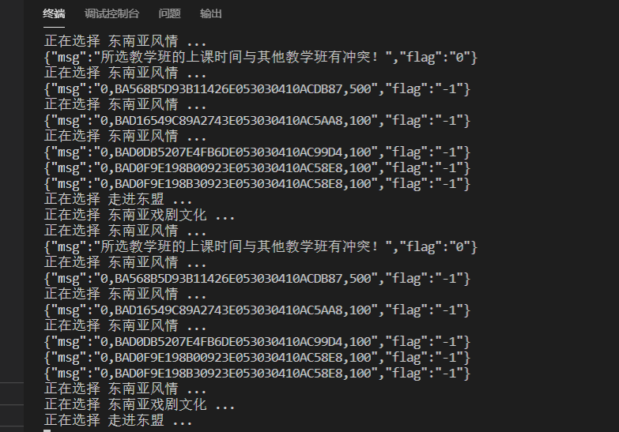

# GXU_Spider

>多线程暴力脚本，大大增加选课成功率

## 使用脚本你可以做到
:heavy_check_mark: 无人值守自动抢课\
:heavy_check_mark: 并发抢课提升成功率\
:heavy_check_mark: 卡时间准时抢课


## 说明

### 环境安装

```python
pip install -r requirements.txt
```
进入Login_test 填写相应字段
```python
XUANXIUKE_TARGET = ['走进东盟', '东南亚风情', '东南亚戏剧文化',]  # 只会选择有这些名称的课程
PE_TARGET = ['游泳']
BIXIU_TARGET = ['数据库原理','计算机网络原理','	算法设计与分析（全英）']

test = SpiderOfGxu(user='1907316666', pwd='password123') #在此处填写用户名和密码 然后运行

```
## 示例



